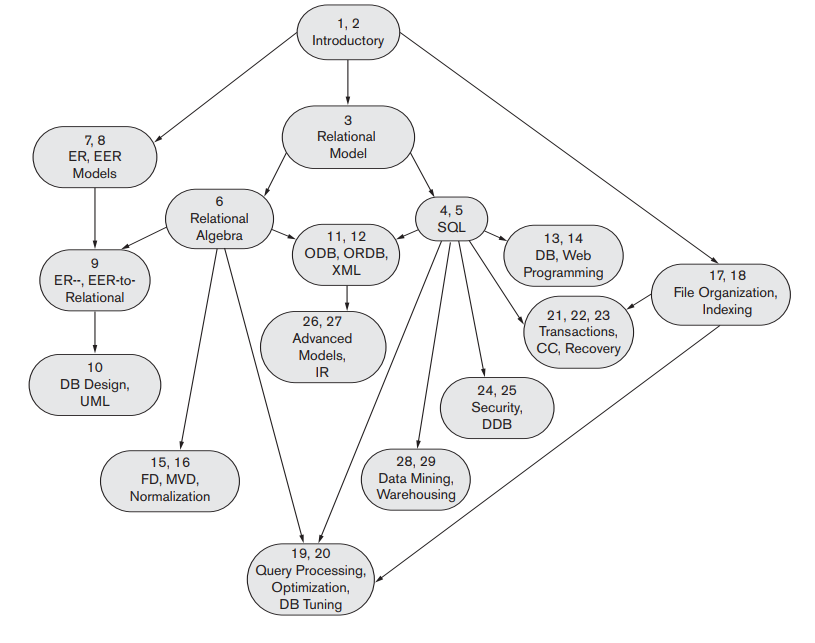

## Mục lục
### Part 1
Chapter 1 và chapter 2: Giới thiệu chung

### Part 2
Chapter 3 -> chapter 6: Giới thiệu về relational database
- Chapter 3: ràng buộc giữa relational model và relational database
- Chapter 4-5: SQL
- Chapter 6: relational algebra và calculus
### Part 3
Chapter 7 -> chapter 10: Entity-relationship modeling and database design
### Part 4
Object and Object-Relational, XML
- Chapter 11: Object and Object-Relational
- Chapter 12: XML
### Part 5
Các kĩ thuật lập trình Database
- Chapter 13: Giới thiệu các kĩ thuật lập trình SQL
- Chapter 14: Lập trình Web database sử dụng PHP

### Part 6

Data base design theory và Normalization

### Part 7
(Chapter 17 và 18) bao gồm các chương về tổ chức file, đánh số và hashing.

### Part 8
(Chapter 19 và 20) bao gồm các chương về quá trình query, các kĩ thuật tối ưu (chương 19) và database tuning (chapter 20)

### Part 9
Transaction Processing, Concurrency Control, and Recovery

### Part 10
Các chủ đề khác về database: Bảo mật, phân phối.

### Part 11
Advanced Database Models, Systems, and Applications

## Cách sử dụng
- Nên đọc từ đầu đến chapter 15, thêm các phần từ các chapter khác dựa vào background và desired coverage (mong muốn cover).
- Chapter 7, 8 (quan trọng) sử dụng ER, EER model để giúp hiểu mô hình khái niệm (conceptual modeling). Nên cover dần dần, về cuối, hoặc thậm chí loại bỏ (nếu triển khai DBMS database management system).
- Chapter 17, 18 có thể cover sớm, muộn hoặc có thể loại bỏ nếu chỉ nhấn mạnh về database models và languages.
- Nếu nhấn mạnh về database design, nên học chapter 7,8 sớm, sau khi học về relational database (part 2).
- Một tổng vòng đời thiết kế database và implement project sẽ cover theo thứ tự:
    - conceptual design (chapter 7, 8)
    - relational database (chapter 3, 4, 5)
    - data model mapping (chapter 9)
    - normalization (chapter 15)
    - application programs implementation with SQL (chapter 13)
    - if emphasis on Web database programming and applications (chapter 14)
- Sách có thể chia làm 2 phần
    - Chapter 1-15: sophomore, junior hoặc senior có thể học được. 
    - Chapter 16-29: senior hoặc first-year graduate level.
## Diagram diễn tả quan hệ giữa các chapter

