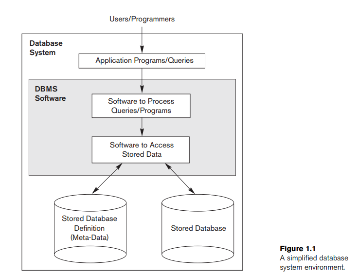
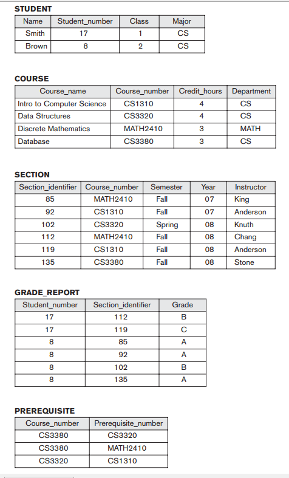

## 1.1 Introduction
* Định nghĩa chung:

A **database** is a collection of related data.

* Các tính chất của database:
    * đại diện một số khía cạnh của thế giới thực, đôi khi gọi là **miniworld** hoặc là **universe of discourse** (UoD)
    * Một database là bộ sư tập logic mạch lạc của data với một số ý nghĩa vốn có. Một loại dữ liệu ngẫu nhiên không thể được coi là database.
    * Một database được thiết kế, xây dựng với mục đích cụ thể, chủ đích vào một nhóm người dùng và một số ứng dụng mà người dùng quan tâm.

**database management system (DBMS)** là một bộ sưu tập các phần mềm cho phép người dùng tạo và duy trì database. DBMS là *general-purpose software system* tạo điều kiện cho quá trình *defining*, *constructing*, *manipulating* và *sharing*.
- **Defining**: xác định data-type, cấu trúc, ràng buộc của data.

database definition cũng được lưu bởi DBMS dưới dạng một database catalog hoặc dictionary, được gọi là **meta-data**.
- **Constructing**: quá trình lưu data trên một số phương tiện lưu trữ được điều khiển bởi DBMS.
- **Manipulating**: các hàm như query, updating, generating reports.
- **Sharing**: cho phép đa người dùng, đa phần mềm truy cập database cùng một lúc.

Một ứng dụng truy cập database bằng cách gửi các queries hoặc request data đến DBMS.

- query -> retrieved data (nhận data)
- **transaction** -> read, written into the database.

*(query: nghĩa là câu hỏi, điều tra. Được sử dụng lỏng lẻo cho cho tất cả các tương tác với datasets bao gồm cả modifying data)*

Các hàm quan trọng khác được cùng cấp bởi DBMS bao gồm *protecting* và *maintaining* qua thời gian dài. 
- **Protection**: bao gồm *system protection* chống lại trục trặc (hoặc tai nạn) của phần cứng và phần mềm (malfunction (crashes) of hardware or software).
- **Maintain**: Một database lớn sẽ có vòng đời lớn trong nhiều năm, nên DBMS phải có khả năng **maintain** database system bằng cách cho phép hệ thống tiến hóa (evolve) như các yêu cầu thay đổi theo thời gian.

Chúng ta sẽ coi: Database + DBMS software = **database system**.

## 1.2 Ví dụ
UNIVERSITY database duy trì các thông tin liên quan đến sinh viên, khóa học, điểm. database được tổ chức bằng 5 files, mỗi file lưu các **data records** (data-sự ghi chép) cùng loại. 
* STUDENTS file: lưu data của mỗi student
* COURSE file: lưu data mỗi course.
* SECTION file: lưu data mỗi section trong 1 course.
* GRADE_REPORT file: lưu điểm trong mỗi section mà mỗi student nhận được.
* PREREQUISITE file: lưu prerequisites cho mỗi course.

### *define*
Để *define* database này, chúng ta cần xác định cấu trúc các bản ghi của mỗi file này bằng cách xác định các kiểu dữ liệu khác nhau của các **data elements** được lưu vào mỗi bản ghi (record).

Ví dụ trong mỗi STUDENT record bao gồm data đại diện cho: tên sinh viên, số của sinh viên, lớp (1 tức là năm 1, 2 là năm 2,...), môn học (CS là computer science, MATH là toán).

Phải xác định **data type** cho mỗi data element trong 1 bản ghi:
- Name: string trong alphabetic characters
- Student_number: integer
- Grade: 1 kí tự từ tập {'A', 'B', 'C', 'D', 'F', 'I'}
- Hoặc có thể sử dụng mã hóa(coding scheme) để đại diện giá trị của data, chẳng hạn ở mục Class, 1 là năm 1, 2 là năm 2,...

### *construct*

Để *construct* UNIVERSITY database, chúng ta lưu data của mỗi student, course, section, grade report, và prerequisite vào mỗi file thích hợp. Lưu ý các dữ liệu trong các file có thể liên quan đến nhau. Ví dụ: Smith trong STUDENT có liên quan đến 2 bản ghi trong GRADE_REPORT ghi điểm của Smith trong 2 sections. Tương tự mỗi bản ghi trong PREREQUISITE liên quan đến 2 bản ghi của course. Hầu hết các database trung bình đến lớn bao gồm nhiều loại bản ghi và có rất nhiều mối quan hệ giữa chúng.

### *manipulating*

Bao gồm truy vấn(querying) và updating. Ví dụ
- Query:
    - Lấy(retrieve) bảng điểm của Smith
    - Liệt kê danh sách các sinh viên học 'Database' vào fall 2008 và điểm của họ
    - Liệt kê prerequisite của khóa 'Database'
- Update:
    - Thay đổi lớp của Smith thành năm 1
    - Tạo một section mới cho 'Database' cho học kì này năm 2019
    - Nhập điểm 'A' cuối kì cho 'Smith' trong khóa 'Database'

Thiết kế một ứng dụng mới với một database đã có hoặc thiết kế một database mới bắt đầu với **requirements specification and analysis**. Các yêu cầu này được ghi lại chi tiết và biến thành **conceptual design** có thể biểu diễn và thao tác bằng các công cụ máy tính và dễ dàng bảo trì, chỉnh sửa và dễ dàng chuyển thành data implementation (mô hình Entity-Relationship trong chapter 7 được sử dụng cho mục đích này). Thiết kế sau đó được translated sang **logical design** có thể thể hiện trong data model được hoàn thành trong commercial DBMS (từ chapter ta nhấn mạnh data model như là Relational Data Model. Cách tiếp cận phổ biến nhất cho thiết kế và triển khai database sử dụng relational DBMSs). Bước cuối là **physical design**.

