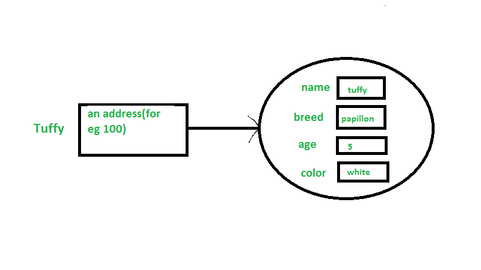

- [Classes và Objects Trong Java](#classes-và-objects-trong-java)
  - [Class](#class)
  - [Object](#object)
    - [Khai báo Object (Instantiating a class)](#khai-báo-object-(instantiating-a-class))
    - [Initializing an object](#initializing-an-object)
    - [Các cách tạo ra object của class](#các-cách-tạo-ra-object-của-class)
    - [Tạo ra nhiều objects chỉ bằng một type (A good practice)](#tạo-ra-nhiều-objects-chỉ-bằng-một-type-(a-good-practice))
    - [Anonymous objects](#anonymous-objects)


# Classes và Objects Trong Java
Class và Object là các khái niệm cơ bản của Lập trình hướng đối tượng xoay quanh các thực thể trong thế giới thực.

## Class
Một class là một bản thiết kế hoặc một mẫu do người dùng thiết kế từ đó mà các đối tượng được tạo ra. Nó đại diện cho tập hợp các tính chất (properties) và các phương thức (methods) chung cho tất cả các đối tượng trong cùng một loại. Nhìn chung, khai báo một class bao gồm các thành phần theo thứ tự sau:

1. **Modifiers**: Một class có thể truy cập public hoặc default.
2. **Class name**: Viết hoa các chữ cái đầu trong các từ.
3. **Superclass(nếu có)**: Tên của class cha nếu có, theo sau bởi từ khóa 'extends'. Một class chỉ có thể extend từ 1 class cha.
4. **Interfaces(nếu có)**: Được ngăn cách nhau bằng các dấu chấm phẩy, theo sau bởi từ khóa 'implements'. Một class có thể implements một hoặc nhiều interfaces.
5. **Body**: nằm trong dấu ngoặc nhọn '{}'

Constructors được sử dụng để khởi tạo các Objects mới. Fileds là các biết cung cấp trạng thái của class và các objects của nó. Các Methods được sử dụng để thực hiện các hành vi của class và các object của nó.

Có nhiều loại classes được sử dụng trong các ứng dụng real time như: nested classes, anonymous classes, lambda expressions.

## Object


Đây là đơn vị cơ bản của OOP và đại diện cho thực thể. Một phần mềm Java có thể tạo nhiều objects, tương tác bởi các lời gọi methods. Một objects bao gồm:
1. **State**: Nó đại diện bởi các thuộc tính của object. Nó cũng phản ánh các thuộc tính của một object.
2. **Behavior**: Nó được đại diện bởi các methods của object. Nó cũng phản ánh phản ứng của một object với các object khác.
3. **Identity**: Trao một tên duy nhất cho object và cho phép object tương tác với các objects khác.

Ví dụ của một object: dog


### Khai báo Object (Instantiating a class)
Khi một object của class được tạo, class được gọi là **instantiated** (khởi tạo). Tất các instances chia sẻ trung các thuộc tính và các hành vi của class. Nhưng giá trị của các thuộc tính tức là các trạng thái của chúng là riêng biệt cho mỗi object. Một class đơn có thể có tùy ý bao nhiêu instances cũng được. Ví dụ:


Khi chúng ta khai báo các biến (type name;). Nó thông báo cho trình biên dịch rằng chúng ta sẽ sử dụng 'name' chỉ đến dữ liệu mà loại của nó là 'type'. Với loại dữ liệu primitive, khai báo này cũng cung cấp một lượng bộ nhớ phù hợp cho biến. Với biến tham chiếu, 'type' phải chỉ rõ class name. Nhìn chung, chúng ta không thể tạo các objects của một abstract class hoặc một interface.

```Dog tuffy;```

Nếu chung ta khởi tạo biến ```tuffy``` như trên, giá trị của nó sẽ không xác định (null) cho đến khi một object thực sự được tạo và gán cho nó. Khởi tạo một biến tham chiếu không tạo ra một object.

### Initializing an object

Toán tử 'new' instatiates một class bằng cách cung cấp bộ nhớ cho một object mới và trả về một reference đến bộ nhớ đó. Toán tử 'new' cũng invokes 'class constructor'.

```
// Class Declaration 

public class Dog 
{ 
	// Instance Variables 
	String name; 
	String breed; 
	int age; 
	String color; 

	// Constructor Declaration of Class 
	public Dog(String name, String breed, 
				int age, String color) 
	{ 
		this.name = name; 
		this.breed = breed; 
		this.age = age; 
		this.color = color; 
	} 

	// method 1 
	public String getName() 
	{ 
		return name; 
	} 

	// method 2 
	public String getBreed() 
	{ 
		return breed; 
	} 

	// method 3 
	public int getAge() 
	{ 
		return age; 
	} 

	// method 4 
	public String getColor() 
	{ 
		return color; 
	} 

	@Override
	public String toString() 
	{ 
		return("Hi my name is "+ this.getName()+ 
			".\nMy breed,age and color are " + 
			this.getBreed()+"," + this.getAge()+ 
			","+ this.getColor()); 
	} 

	public static void main(String[] args) 
	{ 
		Dog tuffy = new Dog("tuffy","papillon", 5, "white"); 
		System.out.println(tuffy.toString()); 
	} 
} 
```

Output:

```
Hi my name is tuffy.
My breed, age and color are papillon,5,white
```

* Class này chứa 1 constructor. Chúng ta nhận ra constructor bởi vì khởi tạo của nó sử dụng tên giống tên của class và nó ko có return type. Trình biên dịch Java phân biệt các hàm constructors dựa trên số và loại của các tham số truyền vào. Constructor trong class Dog nhận 4 tham số. Các following statement cung cấp 'tuffy', 'papillion', 5, 'white' như các giá trị cho các tham số đó:
```
Dog tuffy = new Dog("tuffy", "papillon", 5, "white");
```
Kết quả của câu lệnh trên được diễn tả:


**Note**: Tất cả các classes có ít nhất 1 constructor. Nếu một class không khai báo cụ thể, thì trình biên dịch Java tự động cung cấp một constructor không có tham số, cũng được gọi là default constructor. Default constructor gọi class parent's no-argument constructor (khi nó chỉ chứa duy nhất 1 statement: super();), hoặc Object class constructor nếu class không có parent (vì Object class là cha của tất cả các classes trực tiếp hoặc không trực tiếp).

### Các cách tạo ra object của class

Có 4 cách để tạo ra objects trong java. Đúng ra là chỉ có 1 cách duy nhất (bằng từ khóa `new`). Các cách còn lại một cách nội bộ cũng sử dụng từ khóa `new`.

* Sử dụng từ khóa `new`: nó là cách thông dụng nhất và tổng quát nhất trong java. Ví dụ
``` 
// creating object of class Test
Test t = new Test();
```
* Sử dụng phương thức `Class.forName(String className)` : Có một class được định nghĩa trước trong java.alng pakage với name là `Class`. Phương thức `forName(String className)` trả về Class object liên kết với class với string name cho trước. Chúng ta phải cung cấp 1 tên đầy đủ cho class (tức là từ package nào). Sau đó gọi phương thức `newInstance()` trên class `Class` và sẽ trả về 1 instance của class có tên mà chúng ta cung cấp.

* Sử dụng `clone()` method: `clone()` nằm trong Object class. Nó tạo ra và trả về 1 copy của object.

```
        
// creating object of class Test
Test t1 = new Test();

// creating clone of above object
Test t2 = (Test)t1.clone();
```

* Deseriralization: Là một kỹ thuật đọc một object từ một trạng thái đã lưu trong một file.
```
FileInputStream file = new FileInputStream(filename);
ObjectInputStream in = new ObjectInputStream(file);
Object obj = in.readObject();
```
### Tạo ra nhiều objects chỉ bằng một type (A good practice)

Trong real-time, chúng ta cần phân biệt các objects của một class trong nhiều phương thức khác nhau. Tạo ra một tham chiếu để lưu trữ chúng không phải một cách tốt, do đó chúng ta cần khai báo biến tham chiếu static và sử dụng nó bất cứ khi nào cần. Trong trường hợp này, lãng phí bộ nhớ sẽ giảm, do các object mà ko có tham chiếu đến sẽ được hủy bằng Garbage Collector của java. Ví dụ
```
Test test = new Test();
test = new Test();
```
* Trong hệ thống kế thừa, chúng ta sử dụng một biến tham chiếu kiểu parent để lưu trữ object của sub-class. Trong trường hợp này, chúng ta có thể chuyển đến các object khác nhau của subclass sử dụng cùng một biến tham chiếu. Ví dụ
```
class Animal {}

class Dog extends Animal {}
class Cat extends Animal {}

public class Test
{
    // using Dog object
    Animal obj = new Dog();

    // using Cat object
    obj = new Cat();
}       
```
### Anonymous objects
Anonymous objects là các objects được tạo ra nhưng không được stored trong bất kì biến tham chiếu nào.

* Chúng được sử dụng để ngay lập tự gọi method.
* Sẽ bị hủy ngay sau khi method được gọi.
* Được sử dụng nhiều trong các thư viện. Ví dụ, các thư viện AWT, chúng được sử dụng dể biểu diễn một số hành động như bắt sự kiện (ví dụ nhấn nút từ bàn phím).
* Trong ví dụ dưới, khi nút (btn) được bấm, chúng ta tạo ra một Anonymous objects of EventHandler class để gọi phương thức handle.

