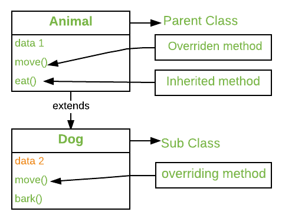
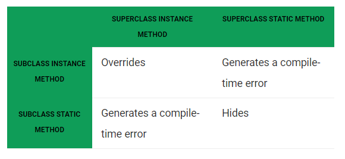

- [Overriding trong Java](#overriding-trong-java)
  - [Quy luật cho method overriding](#quy-luật-cho-method-overriding)
	- [1. **Overriding và Access-Modifiers**:](#1-overriding-và-access-modifiers)
    - [2. **Final methods không thể overriden**:](#2-final-methods-không-thể-overriden)
    - [3. **Static methods không thể overriden(Method Overrding vs Method Hiding)**:](#3-static-methods-không-thể-overriden)
    - [4. **Private methods không thể được overriden**:](#4-private-methods-không-thể-được-overriden)
    - [5. **Các overriding method phải có cùng return type(hoặc subtype)**:](#5-các-overriding-method-phải-có-cùng-return-type)
    - [6. **Invoking overridden method từ sub-class**:](#6-invoking-overridden-method-từ-sub-class)
    - [7. **Overriding and constructor**:](#7-overriding-and-constructor)
    - [8. **Overriding và Exception-Handling**:](#8-overriding-và-exception-handling)
		- [Quy tắc 1:](#quy-tắc-1)
		- [Quy tắc 2:](#quy-tắc-2)
    - [9. **Overriding và abstract method**:](#9-overriding-và-abstract-method)
    - [10. **Overriding và synchironized/strictfp method**](#10-overriding-và-synchironized/strictfp-method)
  - [NOTE:](#note)


# Overriding trong Java

Trong bất kì ngôn ngữ hướng đối tượng, Overriding là tính năng cho phép subclass cung cấp sự hoàn tất một cách cụ thể của method cái đã được cung cấp bởi superclass. Khi một method trong subclass có cùng tên, cùng parameters (hay signature) và có cùng return type(hoặc sub-type) với cái method trong superclass của nó thì method trong subclass được gọi là override của method trong superclass.



Method overriding là một cách mà Java có thể thu được [Run Time Polymorphism](https://www.geeksforgeeks.org/dynamic-method-dispatch-runtime-polymorphism-java/). Phiên bản của method được thực thi sẽ xác định bởi object cái được sử dụng để invoke nó. Nếu một object của parent class được sử dụng để invoke method, thì phiên bản method của parent class sẽ được thực thi và ngược lại nếu  object của subclass được sử dụng để invoke method thì phiên bản của method trong sublcass sẽ được executed. Nói cách khác thì nó là _'type of the object being referred to'_ (không phải type of the reference variable) cái xác định version nào của overriden method sẽ được executed.

```
// A Simple Java program to demonstrate 
// method overriding in java 

// Base Class 
class Parent { 
	void show() 
	{ 
		System.out.println("Parent's show()"); 
	} 
} 

// Inherited class 
class Child extends Parent { 
	// This method overrides show() of Parent 
	@Override
	void show() 
	{ 
		System.out.println("Child's show()"); 
	} 
} 

// Driver class 
class Main { 
	public static void main(String[] args) 
	{ 
		// If a Parent type reference refers 
		// to a Parent object, then Parent's 
		// show is called 
		Parent obj1 = new Parent(); 
		obj1.show(); 

		// If a Parent type reference refers 
		// to a Child object Child's show() 
		// is called. This is called RUN TIME 
		// POLYMORPHISM. 
		Parent obj2 = new Child(); 
		obj2.show(); 
	} 
} 
```
Output:
```
Parent's show()
Child's show()
```
---
## Quy luật cho method overriding

### 1. **Overriding và Access-Modifiers**:
 access modifier cho một overrding method có thể cho phép access nhiều hơn, nhưng không được ít hơn overridden method. Ví dụ, một protected instance method trong superclass có thể public nhưng không được private trong subclass. Nếu làm vậy thì sẽ báo lỗi compile-time error.

```
// A Simple Java program to demonstrate 
// Overriding and Access-Modifiers 

class Parent { 
	// private methods are not overridden 
	private void m1() 
	{ 
		System.out.println("From parent m1()"); 
	} 

	protected void m2() 
	{ 
		System.out.println("From parent m2()"); 
	} 
} 

class Child extends Parent { 
	// new m1() method 
	// unique to Child class 
	private void m1() 
	{ 
		System.out.println("From child m1()"); 
	} 

	// overriding method 
	// with more accessibility 
	@Override
	public void m2() 
	{ 
		System.out.println("From child m2()"); 
	} 
} 

// Driver class 
class Main { 
	public static void main(String[] args) 
	{ 
		Parent obj1 = new Parent(); 
		obj1.m2(); 
		Parent obj2 = new Child(); 
		obj2.m2(); 
	} 
} 
```

ở đoạn code trên method m2 đã được mở rộng từ protected->public.

### 2. **Final methods không thể overriden**:

Nếu chúng ta muốn một method không cho phép overriden thì chúng ta sẽ khai báo nó là final. Xem thêm [Sử dụng final trong kế thừa](https://www.geeksforgeeks.org/using-final-with-inheritance-in-java/).

```
// A Java program to demonstrate that 
// final methods cannot be overridden 

class Parent { 
	// Can't be overridden 
	final void show() {} 
} 

class Child extends Parent { 
	// This would produce error 
	void show() {} 
} 
```
Output:
```
13: error: show() in Child cannot override show() in Parent
    void show() {  }
         ^
  overridden method is final
  ```

### 3. **Static methods không thể overriden(Method Overrding vs Method Hiding)**:

Khi chúng ta định nghĩa một static method với cùng signature với static method trong base class, nó được biết đến như là [method hiding](https://www.geeksforgeeks.org/can-we-overload-or-override-static-methods-in-java/).
Bảng sau tóm tắt điều sẽ xảy ra khi bạn định nghĩa một method trong subclass với cùng chữ kí như method trong superclass.


```
// Java program to show that 
// if the static method is redefined by 
// a derived class, then it is not 
// overriding, it is hiding 

class Parent { 
	// Static method in base class 
	// which will be hidden in subclass 
	static void m1() 
	{ 
		System.out.println("From parent "
						+ "static m1()"); 
	} 

	// Non-static method which will 
	// be overridden in derived class 
	void m2() 
	{ 
		System.out.println("From parent "
						+ "non-static(instance) m2()"); 
	} 
} 

class Child extends Parent { 
	// This method hides m1() in Parent 
	static void m1() 
	{ 
		System.out.println("From child static m1()"); 
	} 

	// This method overrides m2() in Parent 
	@Override
	public void m2() 
	{ 
		System.out.println("From parent "
						+ "non-static(instance) m2()"); 
	} 
} 

// Driver class 
class Main { 
	public static void main(String[] args) 
	{ 
		Parent obj1 = new Parent(); 

		// As per overriding rules this 
		// should call to class Child static 
		// overridden method. Since static 
		// method can not be overridden, it 
		// calls Parent's m1() 
		obj1.m1(); 

		// Here overriding works 
		// and Child's m2() is called 
		obj1.m2(); 
	} 
} 
```
Output:
```
From parent static m1()
From child non-static(instance) m2()
```
### 4. **Private methods không thể được overriden**:
Private methods không thể bị overriden vì chúng bị giới hạn trong khi compile time.

### 5. **Các overriding method phải có cùng return type(hoặc subtype)**:
Từ Java 5.0 trở đi, cho phép có return type khác khi overriding trong subclass, nhưng return type của nó phải sub-type của parent'return type. Hiện tượng này gọi là [covariant return type](https://www.geeksforgeeks.org/covariant-return-types-java/)

### 6. **Invoking overridden method từ sub-class**:
Chúng ta có thể gọi method trong class cha từ overriding method sử dụng từ khóa super:
```
// A Java program to demonstrate that overridden 
// method can be called from sub-class 

// Base Class 
class Parent { 
	void show() 
	{ 
		System.out.println("Parent's show()"); 
	} 
} 

// Inherited class 
class Child extends Parent { 
	// This method overrides show() of Parent 
	@Override
	void show() 
	{ 
		super.show(); 
		System.out.println("Child's show()"); 
	} 
} 

// Driver class 
class Main { 
	public static void main(String[] args) 
	{ 
		Parent obj = new Child(); 
		obj.show(); 
	} 
} 
```
Output:
```
Parent's show()
Child's show()
```
### 7. **Overriding and constructor**:
Không thể override constructor vì tên của nó trùng tên class nên là 2 tên khác nhau.

### 8. **Overriding và Exception-Handling**:
2 Quy tắc:

#### Quy tắc 1:
Nếu superclass overridden method không throw một exception, subclass overriding method chỉ có thể throws ra [unchecked exception](https://www.geeksforgeeks.org/checked-vs-unchecked-exceptions-in-java/), throwing checked exception sẽ dẫn đến compile-time error.
```
/* Java program to demonstrate overriding when 
superclass method does not declare an exception 
*/

class Parent { 
	void m1() 
	{ 
		System.out.println("From parent m1()"); 
	} 

	void m2() 
	{ 
		System.out.println("From parent m2()"); 
	} 
} 

class Child extends Parent { 
	@Override
	// no issue while throwing unchecked exception 
	void m1() throws ArithmeticException 
	{ 
		System.out.println("From child m1()"); 
	} 

	@Override
	// compile-time error 
	// issue while throwin checked exception 
	void m2() throws Exception 
	{ 
		System.out.println("From child m2"); 
	} 
} 
```
Output:
```
error: m2() in Child cannot override m2() in Parent
    void m2() throws Exception{ System.out.println("From child m2");}
         ^
  overridden method does not throw Exception
  ```
#### Quy tắc 2:
Nếu superclass overridden method bắn ra exception, subclass overriding method chỉ có thể bắn ra cùng loại hoặc loại con kế thừa của exception đó. Nếu bắn ra cái exception là parent của cái ban đầu (trong [hệ thống Exception](https://www.geeksforgeeks.org/exceptions-in-java/)) thì ra lỗi compile time error. Cũng không có lỗi gì nếu subclass không bắn ra exception nào.
```
// Java program to demonstrate overriding when 
// superclass method does declare an exception 

class Parent { 
	void m1() throws RuntimeException 
	{ 
		System.out.println("From parent m1()"); 
	} 
} 

class Child1 extends Parent { 
	@Override
	// no issue while throwing same exception 
	void m1() throws RuntimeException 
	{ 
		System.out.println("From child1 m1()"); 
	} 
} 
class Child2 extends Parent { 
	@Override
	// no issue while throwing subclass exception 
	void m1() throws ArithmeticException 
	{ 
		System.out.println("From child2 m1()"); 
	} 
} 
class Child3 extends Parent { 
	@Override
	// no issue while not throwing any exception 
	void m1() 
	{ 
		System.out.println("From child3 m1()"); 
	} 
} 
class Child4 extends Parent { 
	@Override
	// compile-time error 
	// issue while throwing parent exception 
	void m1() throws Exception 
	{ 
		System.out.println("From child4 m1()"); 
	} 
} 
```
Output:
```
error: m1() in Child4 cannot override m1() in Parent
    void m1() throws Exception
         ^
  overridden method does not throw Exception
```

### 9. **Overriding và abstract method**:
 Abstract method trong một interface hoặc một abstract class phải được overridden cụ thể trong các class con nếu không thì sẽ báo lỗi compile-time error.

### 10. **Overriding và synchironized/strictfp method**:
Sự có mặt của synchironized/strictfp modifier không ảnh hưởng đến luật overriding.

## NOTE:
1. Trong C++, chúng ta cần có từ khóa `virtual` để đạt được overriding hoặc Run Time Polymorphism. Trong Java, các method mặc định là virtual.
2. Chúng ta có thể có multilevel method-overriding
```
// A Java program to demonstrate 
// multi-level overriding 

// Base Class 
class Parent { 
	void show() 
	{ 
		System.out.println("Parent's show()"); 
	} 
} 

// Inherited class 
class Child extends Parent { 
	// This method overrides show() of Parent 
	void show() { System.out.println("Child's show()"); } 
} 

// Inherited class 
class GrandChild extends Child { 
	// This method overrides show() of Parent 
	void show() 
	{ 
		System.out.println("GrandChild's show()"); 
	} 
} 

// Driver class 
class Main { 
	public static void main(String[] args) 
	{ 
		Parent obj1 = new GrandChild(); 
		obj1.show(); 
	} 
} 
```
Output:
```
GrandChild's show()
```
