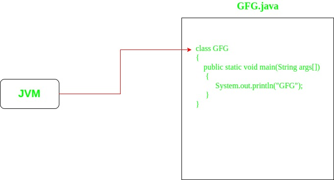

- [**Understanding 'static' trong 'public static void main' trong Java**](#understanding-static-trong-public-static-void-main-trong-java)
  - [1. **main() method**:](#1-main-method)
  - [2. **Static là một từ khóa**.](#2-static-là-một-từ-khóa)
  - [3. **Static methods**:](#3-static-methods)
  - [4. **Static main() method**:](#4-static-main-method)
  - [5. **Sự cần thiết của static trong hàm main()**:](#5-sự-cần-thiết-của-static-trong-hàm-main)

# Understanding 'static' trong 'public static void main' trong Java

Các điều sau giải thích 'static' nghĩa là gì trong main() method:

## 1. **main() method**:
 Trong main() method, nó là cổng vào (điểm vào) cho JVM(Java Virtual Mechine) trong chương trình java. JVM launches chương trình Java bằng cách gọi(invoke) hàm main().


## 2. **Static là một từ khóa**.
 Cách thêm static vào trước bất kì thực thể nào làm cho thực thể đó trở thành một thực thể class. Tức là khi thêm static vào trước methods hay các variables sẽ biến đổi chúng thành class methods và class variables tương ứng, thay vì instance methods (method của 1 cá thế) và instance variables (variable của 1 cá thể).     
Do đó, static methods và variables có thể trực tiếp được truy cập với sự giúp đỡ của Class, có nghĩa là không cần phải tạo ra objects (các cá thể) để truy cập các static methods và variable.

```
// Making a function as static
static void func()
{}

// Making a variable as static
static int var;
```
## 3. **Static methods**: 
Khi một method được khai báo với static keyword, nó được biết đến như static method. Như đã thảo luận ở mục 2, chúng ta có thể truy cập vào các methods này mà không cần tạo ra bất cứ object nào cả.
```
// Making a static function
class GfG
{
    static void func()
    {}
}

// Calling a static function
GfG.func();
```
## 4. **Static main() method**: 
Khi 'static' được đặt ở đầu hàm main, thì nó được gọi là `static main()` method.
```
class GfG
{
    // Making a static main function
    public static void main(String[] args)
    {}
}
```
## 5. **Sự cần thiết của static trong hàm main()**: 
Bởi vì main() là điểm đầu vào của bất kì app Java nào, do đó làm cho hàm main() như một static là điều bắt buộc do các lí do sau:

* static main() method làm cho nó rõ ràng để JVM có thể gọi nó để launching App. Nếu không sẽ phải chỉ định rõ hàm đầu vào cho các ứng dụng Java để JVM có thể biết.
* Method phải là static nếu không sẽ xảy ra sự mơ hồ không biết constructor nào sẽ được gọi. Ví dụ:

```
public class GfG{
  protected GfG(int g){}
  public void main(String[] args){
  }
}
```

Như vậy hàm `main` cần có modifier là static để cho máy ảo Java có thể dễ dàng tìm ra nó mà không cần phải chạy constructor của class. Hàm `main` mà không có modifier là static sẽ gây ra tính mơ hồ cho JVM bởi vì những hàm không phải static cần phải được gọi thông qua constructor và JVM sẽ không biết phải gọi constructor của class nào. Nếu nó chọn 1 class ngẫu nhiên, có thể nó sẽ cần phải cung cấp những tham số của constructor đó, nó sẽ không biết phải truyền vào cái gì. Thử tưởng tượng bằng cách kì diệu nào đó mà nó có thể tự nhận biết và truyền tham số một cách tự động, thì hàm nào trong class đó sẽ là entry point thực sự? Hãy nhớ rằng `main` không phải là một keyword.


