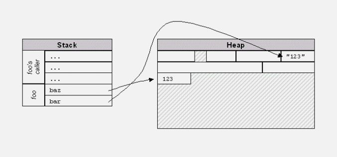
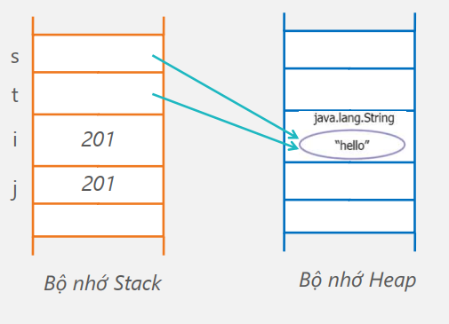

- [Quản lí bộ nhớ trong Java](#quản-lí-bộ-nhớ-trong-java)
  - [Các loại bộ nhớ trong Java](#các-loại-bộ-nhớ-trong-java)
    - [Bộ nhớ Heap](#bộ-nhớ-heap)
    - [Bộ nhớ Stack](#bộ-nhớ-stack)
  - [Bộ thu gom rác](#bộ-thu-gom-rác)
  - [Phương thức `void finalize()`](#phương-thức-void-finalize())

# Quản lí bộ nhớ trong Java
Bài này sẽ nói sâu hơn bài 2 về cách quản lí bộ nhớ trong Java.
* Java không sử dụng con trỏ nên các địa chỉ bộ
nhớ không thể bị ghi đè lên một cách ngẫu nhiên
hoặc cố ý.

* Các vấn đề định vị và tái định vị bộ nhớ, quản lý
bộ nhớ do JVM kiểm soát, hoàn toàn trong suốt
(transparent) với lập trình viên.

* Lập trình viên không cần quan tâm đến việc ghi
dấu các phần bộ nhớ đã cấp phát tđể giải phóng
sau này.

## Các loại bộ nhớ trong Java
* Trong Java có hai loại bộ nhớ chính
    - Bộ nhớ Heap: lưu trữ các dữ liệu được cấp phát cho các tham chiếu.
    - Bộ nhớ stack: lưu trữ các tham chiếu (~địa chỉ các con trỏ) và các dữ liệu nguyên thủy.



### Bộ nhớ Heap
* Bộ nhớ Heap sử dụng để ghi thông tin được tạo bởi toán tử `new`
```
String s = new String("hello");
```


### Bộ nhớ Stack
* Giá trị cục bộ trong bộ nhớ Stack được sử dụng như con trỏ tham chiếu tới Heap
```
String s = new String("hello");
String t = s;
```


* Giá trị của dữ liệu nguyên thủy cũng được ghi trực tiếp trong Stack.

```
String s = new String("hello");
String t = s;
int i = 201;
int j = i;
```


## Bộ thu gom rác
* Một tiến trình chạy ngầm gọi là bộ "thu gom rác" (garbage collector) để phuc hồi lại phần bộ nhớ mà các đối tượng không có tham chiếu đến (tái định vị)
* Các đối tượng không có tham chiếu đến đâu được gán null.
* Bộ thu gom rác định kỳ quét qua danh sách các đối tượng của JVM và phục hồi các tài nguyên của các đối tượng không có tham chiếu.
* JVM quyết định khi nào thực hiện thu gom rác?
    - Thông thường sẽ thực thi khi thiếu bộ nhớ
    - Tại thời điểm không dự đoán trước
* Không thể ngăn quá trình thực hiện của bộ thu gom rác nhưng có thể yêu cầu thực hiện sớm hơn:
    - `System.gc();` hoặc `Runtime.gc();`

## Phương thức `void finalize()`
* Lớp nào cũng có phương thức `finalize()` được thực thi ngay lập tức khi quá trình thu gom xảy ra
* Thường chỉ sử dụng cho các trường hợp đặc biệt để "tự dọn dẹp" các tài nguyên sử dụng khi đối tượng được gc giải phóng.
    - Ví dụ cần đóng các socket, file,... nên được xử lý trong luồng chính trước khi các đối tượng bị ngắt bỏ tham chiếu.
* Tương tự với hàm hủy (destructor) của lớp trong C++.