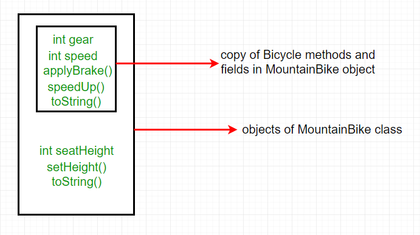
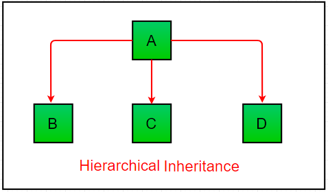

- [**Kế thừa trong java**](#kế-thừa-trong-java)
  - [**Các types kế thừa trong Java**](#các-types-kế-thừa-trong-java)
<<<<<<< HEAD
    - [1. **Single Inheritance**](#1-**single-inheritance**)
    - [2. **Multilevel Inheritance**](#2-**multilevel-inheritance**)
    - [3. **Hierarchical Inheritance (kế thừa phân cấp)**:](#3-hierarchical-inheritance-(kế-thừa-phân-cấp))
    - [4. **Multiple Inheritance (Through Interfaces)**](#4-**multiple-inheritance-(through-interfaces)**)
    - [5. **Hybrid Inheritance(Through Interfaces)**:](#5-**hybrid-inheritance(through-interfaces)**)
=======
    - [1. **Single Inheritance**](#1-single-inheritance)
    - [2. **Multilevel Inheritance**](#2-multilevel-inheritance)
    - [3. **Hierarchical Inheritance (kế thừa phân cấp)**:](#3-hierarchical-inheritance-kế-thừa-phân-cấp)
    - [4. **Multiple Inheritance (Through Interfaces)**](#4-multiple-inheritance-through-interfaces)
    - [5. **Hybrid Inheritance(Through Interfaces)**:](#5-hybrid-inheritance-through-interfaces)
>>>>>>> 8e4c286d94fe4a89e3b0b247a5af30ae45ff2fb0
  - [**Các chú ý về kế thừa trong Java**](#các-chú-ý-về-kế-thừa-trong-java)
  - [**Có thể làm gì trong một Subclass?**](#có-thể-làm-gì-trong-một-subclass)


# Kế thừa trong java
Kế thừa là trục cột quan trọng trong OOP. Nó là cơ chế cho phép 1 class kế thừa các tính năng (fields và methods) của class khác.

**Thuật ngữ quan trọng**:
* **Super Class**: Class mà các tính năng của nó được kế thừa được gọi là super class ( hoặc 1 base class hoặc parent class).
* **Sub Class**: Class cái mà kế thừa từ class khác, được gọi là sub class (hay a derived class, extended class, hay child class). 
* **Reusability(Tái sử dụng)**: Kế thừa hỗ trợ khái niệm 'reusability'. Khi cúng ta muốn tạo một class mới, khi đã có một class chứa một số code chúng ta muốn, chúng ta chuyển hóa (derive) class mới của chúng ta từ class đã tồn tại. Bằng cách đó, chúng ta sử dụng lại các fields và methods của class đã tồn tại.

Từ khóa sử dụng cho inheritance là **extends**.
Cú pháp:
```
class derived-class extends base-class  
{  
   //methods and fields  
}  
```
***
**Example**: Trong ví dụ dưới đây, class Bicycle là base class, class MountainBike là một derived class cái extends class Bicycle và class Test là một driver class để chạy chương trình.
```
//Java program to illustrate the 
// concept of inheritance 

// base class 
class Bicycle 
{ 
	// the Bicycle class has two fields 
	public int gear; 
	public int speed; 
		
	// the Bicycle class has one constructor 
	public Bicycle(int gear, int speed) 
	{ 
		this.gear = gear; 
		this.speed = speed; 
	} 
		
	// the Bicycle class has three methods 
	public void applyBrake(int decrement) 
	{ 
		speed -= decrement; 
	} 
		
	public void speedUp(int increment) 
	{ 
		speed += increment; 
	} 
	
	// toString() method to print info of Bicycle 
	public String toString() 
	{ 
		return("No of gears are "+gear 
				+"\n"
				+ "speed of bicycle is "+speed); 
	} 
} 

// derived class 
class MountainBike extends Bicycle 
{ 
	
	// the MountainBike subclass adds one more field 
	public int seatHeight; 

	// the MountainBike subclass has one constructor 
	public MountainBike(int gear,int speed, 
						int startHeight) 
	{ 
		// invoking base-class(Bicycle) constructor 
		super(gear, speed); 
		seatHeight = startHeight; 
	} 
		
	// the MountainBike subclass adds one more method 
	public void setHeight(int newValue) 
	{ 
		seatHeight = newValue; 
	} 
	
	// overriding toString() method 
	// of Bicycle to print more info 
	@Override
	public String toString() 
	{ 
		return (super.toString()+ 
				"\nseat height is "+seatHeight); 
	} 
	
} 

// driver class 
public class Test 
{ 
	public static void main(String args[]) 
	{ 
		
		MountainBike mb = new MountainBike(3, 100, 25); 
		System.out.println(mb.toString()); 
			
	} 
} 
```
Output:
```
No of gears are 3
speed of bicycle is 100
seat height is 25
```
Trong chương trình trên, khi một object của class MountainBike được tạo, một copy của tất cả các methods và fields của superclass có được memory trong object này. Đó là vì sao khi sử dụng object của subclass chúng ta cũng truy cập members của một superclass.

Chú ý rằng trong khi inheritance chỉ có object của subclass được tạo, không phải của superclass. Để biết thêm, thao khảo [Java Object Creation of Inherited Class.](https://www.geeksforgeeks.org/gfact-52-java-object-creation-of-inherited-classes/)


Minh họa cho chương trình:


Trong thực tế, kế thừa và [đa hình](https://www.geeksforgeeks.org/overriding-in-java/) được sử dụng cùng nhau để đạt được hiệu năng nhanh và tính dễ đọc(readability) của code.

## Các types kế thừa trong Java
Dưới đây là các loại kế thừa được hỗ trợ bởi Java.
### 1. Single Inheritance
1 subclass kế thừa 1 base class.


### 2. Multilevel Inheritance
Một derived class sẽ kế thừa một base class cũng như derived class đó được coi như là base class cho class khác. Như hình dưới, B kế thừa A, rồi C kế thừa B. Trong Java, một class không thể trực tiếp truy cập các members của grandparent (C không trực tiếp truy cập được các members của A).


```
// Java program to illustrate the 
// concept of Multilevel inheritance 
import java.util.*; 
import java.lang.*; 
import java.io.*; 

class one 
{ 
	public void print_geek() 
	{ 
		System.out.println("Geeks"); 
	} 
} 

class two extends one 
{ 
	public void print_for() 
	{ 
		System.out.println("for"); 
	} 
} 

class three extends two 
{ 
	public void print_geek() 
	{ 
		System.out.println("Geeks"); 
	} 
} 

// Drived class 
public class Main 
{ 
	public static void main(String[] args) 
	{ 
		three g = new three(); 
		g.print_geek(); 
		g.print_for(); 
		g.print_geek(); 
	} 
} 
```
Output:
```
Geeks
for
Geeks
```
### 3. Hierarchical Inheritance (kế thừa phân cấp)

Trong Hierarchical Inheritance, một class làm superclass(base class) cho nhiều hơn một class.


```
// Java program to illustrate the 
// concept of Hierarchical inheritance 
import java.util.*; 
import java.lang.*; 
import java.io.*; 

class one 
{ 
	public void print_geek() 
	{ 
		System.out.println("Geeks"); 
	} 
} 

class two extends one 
{ 
	public void print_for() 
	{ 
		System.out.println("for"); 
	} 
} 

class three extends one 
{ 
	/*............*/
} 

// Drived class 
public class Main 
{ 
	public static void main(String[] args) 
	{ 
		three g = new three(); 
		g.print_geek(); 
		two t = new two(); 
		t.print_for(); 
		g.print_geek(); 
	} 
} 
```
Output:
```
Geeks
for
Geeks
```

### 4. Multiple Inheritance (Through Interfaces)

Đa kế thừa thông qua interface. 


```
// Java program to illustrate the 
// concept of Multiple inheritance 
import java.util.*; 
import java.lang.*; 
import java.io.*; 

interface one 
{ 
	public void print_geek(); 
} 

interface two 
{ 
	public void print_for(); 
} 

interface three extends one,two 
{ 
	public void print_geek(); 
} 
class child implements three 
{ 
	@Override
	public void print_geek() { 
		System.out.println("Geeks"); 
	} 

	public void print_for() 
	{ 
		System.out.println("for"); 
	} 
} 

// Drived class 
public class Main 
{ 
	public static void main(String[] args) 
	{ 
		child c = new child(); 
		c.print_geek(); 
		c.print_for(); 
		c.print_geek(); 
	} 
} 
```
Output:
```
Geeks
for
Geeks
```
### 5. Hybrid Inheritance(Through Interfaces):

Kết hợp các loại kế thừa trên. Do Java không hỗ trợ đa kế thừa nên phải có interface.


---
## Các chú ý về kế thừa trong Java
* **Default superclass**: Trừ Object class, mọi class đều có 1 và chỉ 1 class cha. Nếu vắng mặt class cha thì ngầm hiểu rằng class cha của nó là class Object.
* **Superclass can only be one:** Một class có thể có nhiều subclass nhưng 1 class chỉ có thể có 1 superclass. Do Java không hỗ trợ đa kế thừa với class. (chỉ đa kế thừa với interface)
* **Inheriting Constructors**: Một subclass kế thừa các members (fields, methods, and nested classes) từ superclass. Constructors không phải members nên chúng không được kế thừa từ superclasses, nhưng constructor của superclass có thể được invoked từ subclass.
* **Private member inheritance**: Một subclass không kế thừa private members của parent class. Tuy nhiên nếu superclass có public hay protected methods (như getters, setters) cho phép truy cập các private fields của nó, chúng cũng có thể được sử dụng bởi subclass.

---
## Có thể làm gì trong một Subclass?

Trong các sub-classes, chúng ta có thể kế thừa các members như là, thay đổi chúng, ẩn chúng, bổ sung chúng với các members mới.

* inherited fields có thể được sử dụng trực tiếp, giống các loại field khác.
* Chúng ta có thể khai báo fields mới trong subclass cái không có trong superclass.
* Có thể viết 1 method trùng tên method trong superclass và overriding nó.
* Chúng ta có thể viết một static method mới trong subclass cái có cùng chữ kí với cái trong superclass, và do đó sẽ làm [hiding](https://www.geeksforgeeks.org/g-fact-63/) nó.
* Chúng ta có thể khai báo các methods mới mà không có trong superclass.
* Có thể viết constructor invokes constructor của superclass. hoặc ngầm định hoặc sử dụng từ khóa super.


