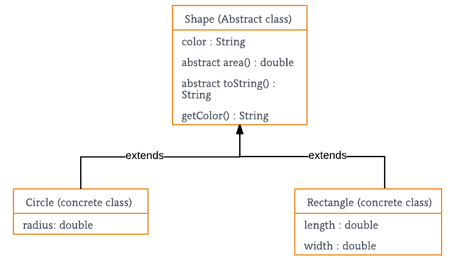

- [Abstraction in Java](#abstraction-in-java)
  - [Abstract class and Abstract methods:](#abstract-class-and-abstract-methods)
  - [Khi nào sử dụng abstract classes và abstract methods.](#khi-nào-sử-dụng-abstract-classes-và-abstract-methods)
  - [Đóng gói và Data Abstraction](#Đóng-gói-và-data-abstraction)
  - [Lợi ích của Trừu tượng hóa](#lợi-ích-của-trừu-tượng-hóa)

# Abstraction in Java
Data abstraction là các tính chất mà theo đó chỉ có các chi tiết mang tính bản chất được trưng bày.

## Abstract class and Abstract methods:
1. Một abstract class là một class được khai báo bằng từ khóa abstract
2. Một abstract method là method được khai báo ko đầy đủ.
3. Một abstract class không nhất phải có tất cả các class là abstract.
4. Một method được định nghĩa abstract phải được định nghĩa lại bằng cách ghi đè bởi subclass hoặc nếu không phải làm subclass đó là abstract class.
5. Bất kì class nào chứa 1 hoặc nhiều abstract methods phải được khai báo là abstract class.
6. Không có object của một abstract class. (không sử dụng được từ khóa new cho abstract class).
7. Một class abstract có thể có các constructors tham số hóa . Và default constructor luôn có trong một abstract class.

## Khi nào sử dụng abstract classes và abstract methods.

Có nhiều trường hợp trong đó chúng ta muốn định nghĩa một superclass cái khai báo cấu trúc của một sự trừa tượng cho trước với không cung cấp đầy đủ cho mỗi method. Tức là đôi khi chúng ta muốn tạo ra superclass cái chỉ định nghĩa một dạng tổng quát để chia sẻ cho các subclass của nó, để các phương thức đấy cho các subclass hoàn thiện.

Xem xét class 'shape' :

```
// Java program to illustrate the 
// concept of Abstraction 
abstract class Shape 
{ 
	String color; 
	
	// these are abstract methods 
	abstract double area(); 
	public abstract String toString(); 
	
	// abstract class can have constructor 
	public Shape(String color) { 
		System.out.println("Shape constructor called"); 
		this.color = color; 
	} 
	
	// this is a concrete method 
	public String getColor() { 
		return color; 
	} 
} 
class Circle extends Shape 
{ 
	double radius; 
	
	public Circle(String color,double radius) { 

		// calling Shape constructor 
		super(color); 
		System.out.println("Circle constructor called"); 
		this.radius = radius; 
	} 

	@Override
	double area() { 
		return Math.PI * Math.pow(radius, 2); 
	} 

	@Override
	public String toString() { 
		return "Circle color is " + super.color + 
					"and area is : " + area(); 
	} 
	
} 
class Rectangle extends Shape{ 

	double length; 
	double width; 
	
	public Rectangle(String color,double length,double width) { 
		// calling Shape constructor 
		super(color); 
		System.out.println("Rectangle constructor called"); 
		this.length = length; 
		this.width = width; 
	} 
	
	@Override
	double area() { 
		return length*width; 
	} 

	@Override
	public String toString() { 
		return "Rectangle color is " + super.color + 
						"and area is : " + area(); 
	} 

} 
public class Test 
{ 
	public static void main(String[] args) 
	{ 
		Shape s1 = new Circle("Red", 2.2); 
		Shape s2 = new Rectangle("Yellow", 2, 4); 
		
		System.out.println(s1.toString()); 
		System.out.println(s2.toString()); 
	} 
} 
```
Output
```
Shape constructor called
Circle constructor called
Shape constructor called
Rectangle constructor called
Circle color is Redand area is : 15.205308443374602
Rectangle color is Yellowand area is : 8.0
```
## Đóng gói và Data Abstraction
1. Đóng gói là ẩn data(information hiding) trong khi Abstraction là detail hiding (implementation hiding).
2. Trong khi đóng gói gộp các data và methods các thực thi trên data. Data abstraction phơi bày giao diện cho người dùng và ẩn các chi tiết thực hiện.

## Lợi ích của Trừu tượng hóa
1. Giảm sự phức tạp của nhìn nhận sự việc.
2. Tránh sự lặp code và tăng tính dùng lại.
3. Giúp bảo mật tốt vì chỉ các chi tiết quan trọng được cung cấp cho người dùng.