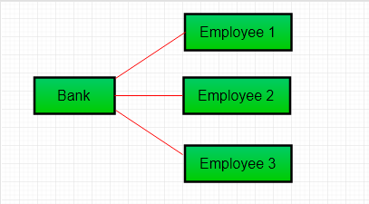

- [Association](#association)
- [Aggregation](#aggregation)
  - [Khi nào sử dụng Aggregation?](#khi-nào-sử-dụng-aggregation)
- [Composition](#composition)
  - [Aggregation và Composition](#aggregation-và-composition)

# Association
Association là quan hệ giữa 2 classes phân biệt cái được thành lập thông qua các Objects của chúng. Association có thể là 1-1, 1-many, many-1, many-many. Trong lập trình hướng đối tượng, một Object giao tiếp đến object khác để sử dụng tính năng và dich vụ được cung cấp bởi object đó. **Composition** và **Aggregation** là 2 dạng của association.


```
// Java program to illustrate the 
// concept of Association 
import java.io.*; 

// class bank 
class Bank 
{ 
	private String name; 
	
	// bank name 
	Bank(String name) 
	{ 
		this.name = name; 
	} 
	
	public String getBankName() 
	{ 
		return this.name; 
	} 
} 

// employee class 
class Employee 
{ 
	private String name; 
	
	// employee name 
	Employee(String name) 
	{ 
		this.name = name; 
	} 
	
	public String getEmployeeName() 
	{ 
		return this.name; 
	} 
} 

// Association between both the 
// classes in main method 
class Association 
{ 
	public static void main (String[] args) 
	{ 
		Bank bank = new Bank("Axis"); 
		Employee emp = new Employee("Neha"); 
		
		System.out.println(emp.getEmployeeName() + 
			" is employee of " + bank.getBankName()); 
	} 
} 
```
Output
```
Neha is employee of Axis
```

Trong ví dụ trên 2 class riêng Bank và Employee được associated through Objects của nó. Bank có thể có nhiều employees, cho nên nó là một mối quan hệ 1-many.



# Aggregation

Đây là một dạng dặc biệt của Association ở đó:
* Nó đại diện Has-A relationship
* Nó là association một chiều, tức là quan hệ một chiều. Ví dụ, phòng ban có các sinh viên nhưng điều ngược lại không có.
* Trong Aggregation, cả 2 thực thể tồn tại độc lập, tức là DEL một thực thể sẽ không làm ảnh hưởng đến thực thể còn lại.

```
// Java program to illustrate 
//the concept of Aggregation. 
import java.io.*; 
import java.util.*; 

// student class 
class Student 
{ 
	String name; 
	int id ; 
	String dept; 
	
	Student(String name, int id, String dept) 
	{ 
		
		this.name = name; 
		this.id = id; 
		this.dept = dept; 
		
	} 
} 

/* Department class contains list of student 
Objects. It is associated with student 
class through its Object(s). */
class Department 
{ 
	
	String name; 
	private List<Student> students; 
	Department(String name, List<Student> students) 
	{ 
		
		this.name = name; 
		this.students = students; 
		
	} 
	
	public List<Student> getStudents() 
	{ 
		return students; 
	} 
} 

/* Institute class contains list of Department 
Objects. It is asoociated with Department 
class through its Object(s).*/
class Institute 
{ 
	
	String instituteName; 
	private List<Department> departments; 
	
	Institute(String instituteName, List<Department> departments) 
	{ 
		this.instituteName = instituteName; 
		this.departments = departments; 
	} 
	
	// count total students of all departments 
	// in a given institute 
	public int getTotalStudentsInInstitute() 
	{ 
		int noOfStudents = 0; 
		List<Student> students; 
		for(Department dept : departments) 
		{ 
			students = dept.getStudents(); 
			for(Student s : students) 
			{ 
				noOfStudents++; 
			} 
		} 
		return noOfStudents; 
	} 
	
} 

// main method 
class GFG 
{ 
	public static void main (String[] args) 
	{ 
		Student s1 = new Student("Mia", 1, "CSE"); 
		Student s2 = new Student("Priya", 2, "CSE"); 
		Student s3 = new Student("John", 1, "EE"); 
		Student s4 = new Student("Rahul", 2, "EE"); 
	
		// making a List of 
		// CSE Students. 
		List <Student> cse_students = new ArrayList<Student>(); 
		cse_students.add(s1); 
		cse_students.add(s2); 
		
		// making a List of 
		// EE Students 
		List <Student> ee_students = new ArrayList<Student>(); 
		ee_students.add(s3); 
		ee_students.add(s4); 
		
		Department CSE = new Department("CSE", cse_students); 
		Department EE = new Department("EE", ee_students); 
		
		List <Department> departments = new ArrayList<Department>(); 
		departments.add(CSE); 
		departments.add(EE); 
		
		// creating an instance of Institute. 
		Institute institute = new Institute("BITS", departments); 
		
		System.out.print("Total students in institute: "); 
		System.out.print(institute.getTotalStudentsInInstitute()); 
	} 
} 
```
Output
```
Total students in institute: 4
```

Trong ví dụ này: Institute class có 1 tham chiếu đến Object hoặc list Objects của Department class. Có nghĩa là Institue class được associated với Department class thông qua Object(s) của nó. Và Department class cũng có tham chiếu đến Object hoặc Objects (list of Objects) của Student class có nghĩa là nó được associated với Student class thông qua các Object(s) của nó.


## Khi nào sử dụng Aggregation??

Code reuse is best achieved by aggregation.

# Composition

Composition là dạng hạn chế của Aggregation trong đó 2 thực tế liên quan đến nhau.
* Đại diện cho quan hệ part-of
* Trong composition, cả 2 phụ thuộc lẫn nhau
* Khi có một composition giữa 2 thực thể, composed object không thể tồn tại nếu thiếu thực thể còn lại

Lấy ví dụ về Library:
```
// Java program to illustrate 
// the concept of Composition 
import java.io.*; 
import java.util.*; 

// class book 
class Book 
{ 

	public String title; 
	public String author; 
	
	Book(String title, String author) 
	{ 
		
		this.title = title; 
		this.author = author; 
	} 
} 

// Libary class contains 
// list of books. 
class Library 
{ 

	// reference to refer to list of books. 
	private final List<Book> books; 
	
	Library (List<Book> books) 
	{ 
		this.books = books; 
	} 
	
	public List<Book> getTotalBooksInLibrary(){ 
		
	return books; 
	} 
	
} 

// main method 
class GFG 
{ 
	public static void main (String[] args) 
	{ 
		
		// Creating the Objects of Book class. 
		Book b1 = new Book("EffectiveJ Java", "Joshua Bloch"); 
		Book b2 = new Book("Thinking in Java", "Bruce Eckel"); 
		Book b3 = new Book("Java: The Complete Reference", "Herbert Schildt"); 
		
		// Creating the list which contains the 
		// no. of books. 
		List<Book> books = new ArrayList<Book>(); 
		books.add(b1); 
		books.add(b2); 
		books.add(b3); 
		
		Library library = new Library(books); 
		
		List<Book> bks = library.getTotalBooksInLibrary(); 
		for(Book bk : bks){ 
			
			System.out.println("Title : " + bk.title + " and "
			+" Author : " + bk.author); 
		} 
	} 
} 
```
Output
```
Title : EffectiveJ Java and  Author : Joshua Bloch
Title : Thinking in Java and  Author : Bruce Eckel
Title : Java: The Complete Reference and  Author : Herbert Schildt
```
Trong  ví dụ trên library có thể có no. of books. Nên nếu Library bị phá hủy thì tất cả các books sẽ bị phá hủy. Tức là books không thể tồn tại nếu thiếu library. Đó là composition.

## Aggregation và Composition

1. **Dependency**: Aggregation ngụ ý mối quan hệ ở đố child có thể tồn tại độc lập. Ví dụ, Bank và Employee, delete Bank thì Employee vẫn tồn tại. Trong khi Composition ngụ ý một mối quan hệ child không thể tồn tại độc lập. Ví dụ con người và trái tim, trái tim không thể tồn tại độc lập khỏi con người.
2. **Type of Raltionship**: Aggregation quan hệ là 'has-a' còn composition quan hệ là 'part-of'
3. **Type of association**: Composition là một strong Association trong khi Aggregation là một weak Association.

```
// Java program to illustrate the 
// difference between Aggregation 
// Composition. 

import java.io.*; 

// Engine class which will 
// be used by car. so 'Car' 
// class will have a field 
// of Engine type. 
class Engine 
{ 
	// starting an engine. 
	public void work() 
	{ 
		
		System.out.println("Engine of car has been started "); 
		
	} 
	
} 

// Engine class 
final class Car 
{ 
	
	// For a car to move, 
	// it need to have a engine. 
	private final Engine engine; // Composition 
	//private Engine engine;	 // Aggregation 
	
	Car(Engine engine) 
	{ 
		this.engine = engine; 
	} 
	
	// car start moving by starting engine 
	public void move() 
	{ 
		
		//if(engine != null) 
		{ 
			engine.work(); 
			System.out.println("Car is moving "); 
		} 
	} 
} 

class GFG 
{ 
	public static void main (String[] args) 
	{ 
		
		// making an engine by creating 
		// an instance of Engine class. 
		Engine engine = new Engine(); 
		
		// Making a car with engine. 
		// so we are passing a engine 
		// instance as an argument while 
		// creating instace of Car. 
		Car car = new Car(engine); 
		car.move(); 
		
	} 
} 
```
Output:
```
Engine of car has been started 
Car is moving 
```
Trong trường hợp của aggregation, Car cũng thực hiện chức năng của nó thông qua một Engine, nhưng Engine không luôn luôn là một phần của Car. Engine có thể được hoán đổi hoặc thậm chí tháo rời khỏi Car. Đó là lí do tại sao chúng ta làm cho Engine có type field là non-final.


